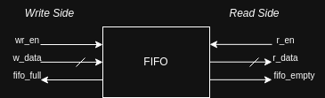

# FIFO (First-In First-Out) Designs in Verilog

This repository contains Verilog implementations of FIFO (First-In First-Out) memory buffers, a critical component in digital design used for data communication between different processes or clock domains. The repo is structured into **Synchronous** and **Asynchronous** FIFO implementations.

## 📦 What is a FIFO?

A FIFO (First-In, First-Out) buffer is a memory queue in which the data written first is read out first. It is widely used in hardware systems for:

- Clock domain crossing (CDC)
- Buffering data between modules
- Rate matching between producer and consumer processes

Two major types of FIFOs are commonly used in digital systems:

### ✅ Synchronous FIFO

- Both read and write operations happen under the same clock.
- Easier to design and simulate.
- Used when the producer and consumer share a common clock domain.

### 🔀 Asynchronous FIFO

- Read and write operations occur under different clocks.
- More complex, involving pointer synchronization techniques.
- Used in systems with different clock domains (e.g., between peripherals and processor cores).

## 🧰 Tools & Technologies

- **Language:** Verilog HDL
- **Simulation/Testbenches:** Icarus Verilog, Vivado
- **Version Control:** Git